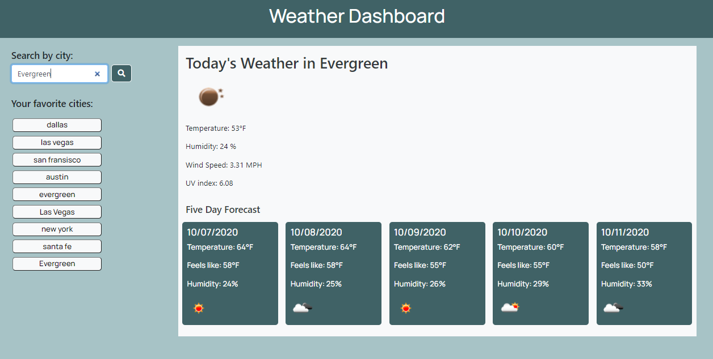

# WEATHER DASHBOARD

Use the OpenWeather API to retrieve weather data for cities. The documentation includes a section called "How to start" that will provide basic setup and usage instructions. Use localStorage to store any persistent data.

### CRITERIA/REQUIREMENTS

GIVEN a weather dashboard with form inputs

WHEN I search for a city
THEN I am presented with the city name, date, a weather condition icon, current conditions, a five day weather forecast, and the city is added to my Favorites List (i.e. the search history)

WHEN I view the current local conditions
THEN I am presented with the temperature, humidity, wind speed, and a color coded UV index rating (favorable, moderate, or severe)

WHEN I view future weather conditions for that city
THEN I am presented with a 5-day forecast that displays the date, a weather condition icon, the temperature and the humidity

WHEN I click on a city in my Favorites List
THEN I am presented with current and future conditions for that city

WHEN I open the weather dashboard at a later date
THEN my searched cities will show in my Favorites List

#### DEVELOPMENTS/COMMITS

* Created repo and initial commit
* Created basic html, css and started js - added API URL and API key
* Added lets, local storage, search btn to js - console.log successful
* Updated html & js - not pulling from open weather, think it's a mispelling
* Changed a few styling elements, worked on js - open weather API working, still need to add UV index
* Added low/high temps to 5 day forecast, changed some styling elements - UV index still   not working

### IMPROVEMENTS/QUESTIONS

* Need to work on "badges" (i.e. color coding) - had it working
* Would have liked to have had the city name in <h2> automatically capitalize

### SCREENSHOT

 

